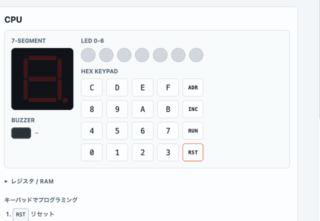

# ORANGE-4 Web Lab

GMC-4 互換の4bitマイコン向けに、ブラウザだけでプログラムを書き、動かし、実機へ転送するための実験用Web開発環境です。

**[▶ ブラウザで開く（GitHub Pages）](https://optimisuke.github.io/orange-4-web-lab/)**



アセンブリを書いて Assemble → Load to RAM → RUN でエミュレーターが動きます。実機（ORANGE-4）へはシリアル接続で転送できます。

## ORANGE-4とは

ORANGE-4は、ピコソフトの4bitマイコン組立てキットです。学研「大人の科学マガジン Vol.24」付録の GMC-4 と機械語レベルで互換性があり、本体だけで機械語プログラミングを学べます。

- ORANGE-4公式ページ: http://www.picosoft.co.jp/ORANGE-4/
- 公式マニュアル: http://www.picosoft.co.jp/ORANGE-4/download/ORANGE-4-manual.pdf
- USBシリアル接続資料: http://www.picosoft.co.jp/orange/download/usbserial.pdf

## できること

- アセンブリ風ソースを機械語 nibble 列へ変換
- Machine Code欄へHEXを直接入力・編集
- ブラウザ内エミュレーターでの実行（ADR / INC / RUN / RST ボタン）
- 7セグメントLED・LED 0–6・ブザー音をブラウザ上で再現
- 16進キーパッドからRAMへ直接書き込み（実機と同じ操作感）
- Web Serial APIでORANGE-4モニターへ接続して実機転送
- `e00:<HEX列>` 形式でRAM書込み、`w0`–`w3` でフラッシュ保存

## 画面の見方

| パネル | 内容 |
| --- | --- |
| **Source** | アセンブリ入力・サンプル選択・Assemble ボタン |
| **Machine Code** | HEXの確認・編集 → ブラウザ（Load to RAM）または実機（Send to ORANGE-4）へ送る |
| **CPU** | 7セグ・LED・ブザー・HEX キーパッド・ADR/INC/RUN/RST ボタン |
| **Serial Monitor** | ORANGE-4との送受信ログ・モニターコマンド |

### CPU ボタン

| ボタン | 動作 |
| --- | --- |
| **ADR** | アドレス指定モード。続けてキーパッドで2桁入力してPCを移動 |
| **INC** | 通常時: 1命令実行。書込みモード時: PCを1進めるだけ |
| **RUN** | 連続実行 / 停止 |
| **RST** | レジスタ・PC・LED・7セグを初期化（RAMは保持） |

### キーパッドでのプログラミング

実機と同じ手順でキーパッドからRAMへ直接書き込めます。

1. **RST** でリセット
2. **ADR** → キーパッドで2桁入力してアドレスを指定
3. キーパッドで1桁ずつ入力 → RAMへ書き込み、次のアドレスへ自動移動
4. **INC** で書き込まずに次のアドレスへ移動
5. **RUN** で実行

## ローカル起動

Node.js と Python が入っていれば、追加ライブラリなしで動きます。

```bash
npm run dev
# → http://localhost:5173
```

Web Serial APIを使う場合は Chrome または Edge 系ブラウザで開いてください。

## サンプル: LEDを順番に点灯

```asm
; LED 0-6 を順番に点灯
TIY 0
CAL 1
AIY 1
CIY 7
JUMP 02
TIA 9
AO
JUMP 0B
```

`↓ Assemble` → `Load to RAM` → `RUN` で動作します。

## サンプル: キー入力を7セグに表示

```asm
; キー入力があるまで待ち、押されたキーを7セグへ表示
KA
JUMP 00
AO
JUMP 02
```

キーボードショートカット:

```
z x c v  →  0 1 2 3
a s d f  →  4 5 6 7
q w e r  →  8 9 A B
1 2 3 4  →  C D E F
```

## 対応命令

| 命令 | 意味 |
| --- | --- |
| `KA` | キー入力をAへ |
| `AO` | Aを7セグへ表示 |
| `CH` | A/B、Y/Zを交換 |
| `CY` | A/Yを交換 |
| `AM` | AをM(50+Y)へ保存 |
| `MA` | M(50+Y)をAへ |
| `M+` | M(50+Y)+AをAへ |
| `M-` | M(50+Y)-AをAへ |
| `TIA n` | Aに4bit値nを入れる |
| `AIA n` | Aにnを加算 |
| `TIY n` | Yに4bit値nを入れる |
| `AIY n` | Yにnを加算 |
| `CIA n` | Aとnを比較 |
| `CIY n` | Yとnを比較 |
| `CAL n` | サブルーチン命令 |
| `JUMP nn` | Flagが1ならnnへジャンプ |

`CAL` サブルーチン:

| CAL | 意味 |
| --- | --- |
| `CAL 0` | 7セグOFF |
| `CAL 1` | LED(Y) ON |
| `CAL 2` | LED(Y) OFF |
| `CAL 4` | Aをビット反転 |
| `CAL 5` | A/B/Y/Z と A'/B'/Y'/Z' を交換 |
| `CAL 6` | Aを右シフト |
| `CAL 7` | 終了音 |
| `CAL 8` | エラー音 |
| `CAL 9` | 短音 |
| `CAL A` | 長音 |
| `CAL B` | Aに応じた音 |
| `CAL C` | タイマー |
| `CAL D` | M(5E), M(5F)をLEDへ表示 |
| `CAL E` | BCD減算 |
| `CAL F` | BCD加算 |

## 実機へ転送する

1. ORANGE-4とUSBシリアルを接続
2. Chrome/Edgeで開いて `Connect` を押し、ポートを選択
3. ORANGE-4本体で `RST` → `D` → `RUN` の順でモニターを起動
4. `Status` でログに応答が返ることを確認
5. `Send to ORANGE-4` でプログラムを転送
6. 必要に応じて `Save Flash` でフラッシュへ保存（ページ0–3）

デフォルト: Baud `115200` / Line End `CR` / Format `Monitor e00:`

## 開発者向け

```bash
npm test       # 単体テスト (32件)
npm run check  # 構文チェック
```

主なファイル:

| ファイル | 内容 |
| --- | --- |
| `index.html` | 画面構造 |
| `src/app.js` | UI・Web Serial・音声制御 |
| `src/gmc4.js` | GMC-4 CPUエミュレーター・アセンブラ・HEXパーサー |
| `test/gmc4.test.js` | 単体テスト |

技術スタック: HTML / CSS / JavaScript ES Modules / Web Serial API / Web Audio API / Node.js built-in test runner

## 参考

- ORANGE-4公式ページ: http://www.picosoft.co.jp/ORANGE-4/
- PyGmc4: https://github.com/jay-kumogata/PyGmc4
- GMC-4 Web Minimal: https://github.com/takahashilabo/GMC-4-Web-Minimal
- ORANGE-4モニター起動: https://sanuki-tech.net/and-more/2022/picosoft-orange-4-monitor/
